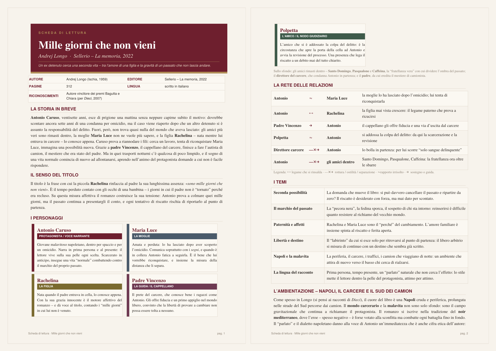

# 📚 Schede di Libri

> **Una libreria personale di schede di lettura.** Un progetto utile per *ricordare*:
> personaggi, relazioni, temi e contesto di ogni libro che ho letto, condensati in
> una scheda PDF che si legge in un colpo d'occhio.


<p align="center">
  
  <br>
  <em>Esempio: la scheda di «Mille giorni che non vieni» di Andrej Longo.</em>
</p>

---

## ✨ L'idea

Il valore di un libro tende a sbiadire: a distanza di mesi restano un'impressione e
poche frasi. Questo progetto nasce per **fissare la memoria di una lettura** in un
documento sintetico e ricorrente — una specie di *fascicolo tecnico* del libro.

La regola è una sola: **cambia il contenuto, non il formato.** Ogni scheda condivide
la stessa architettura grafica e la stessa struttura di sezioni, così la raccolta
cresce come una collana editoriale coerente, non come un insieme di file scollegati.

---

## 🧠 Cosa lo rende (tecnicamente) interessante

- **Separazione tra dati e presentazione.** Il progetto adotta la stessa logica di un
  pattern *model–view*: un **motore di impaginazione invariante** e un **blocco dati**
  per ogni libro. Il layout non si tocca mai; si modifica solo il dizionario con
  titolo, sinossi, personaggi, relazioni, temi. Ne deriva la proprietà che cercavo:
  **riproducibilità** e **omogeneità** garantite per costruzione, non per disciplina manuale.
- **Generazione parametrica.** Le schede sono *prodotte*, non *disegnate a mano*: il
  numero di personaggi, le strisce di colore, la griglia tecnica si adattano in automatico.
- **Rigore editoriale.** I dati bibliografici sono verificati su fonti; i contenuti sono
  sempre **parafrasati** (nessun testo riprodotto, niente problemi di copyright); il
  finale non viene rivelato, salvo richiesta esplicita.

---

## 🗂️ Le schede disponibili

| Autore | Titolo | Scheda |
|---|---|---|
| Niccolò Ammaniti | *Il Custode* | [PDF](ammaniti_il-custode_scheda.pdf) |
| Niccolò Ammaniti | *Io e te* | [PDF](ammaniti_io-e-te_scheda.pdf) |
| Jana Karšaiová | *Divorzio di velluto* | [PDF](divorzio_di_velluto_scheda.pdf) |
| Andrej Longo | *Mille giorni che non vieni* | [PDF](longo_mille-giorni_scheda.pdf) |
| Andrej Longo | *Solo la pioggia* | [PDF](longo_solo-la-pioggia_scheda.pdf) |
| Domenico Starnone | *Destinazione errata* | [PDF](starnone_destinazione-errata_scheda.pdf) |

---

## 🧬 Anatomia di una scheda

Ogni scheda segue questo ordine fisso di sezioni (alcune si omettono se non pertinenti):

1. **Testata** — titolo, riga «autore · editore, anno», etichetta *SCHEDA DI LETTURA* e una frase-sintesi.
2. **Scheda tecnica** — griglia con autore, editore, anno, pagine, lingua, riconoscimenti.
3. **La storia in breve** — 4–7 frasi, parafrasi, senza spoiler.
4. **Il senso del titolo** — solo se il titolo ha una chiave interpretativa.
5. **I personaggi** — card a riquadro con striscia colorata, ruolo e funzione narrativa.
6. **La rete delle relazioni** — tabella con legenda dei simboli (`↔` legame che si rinsalda · `—✕→` rottura · `≈` rapporto irrisolto · `→` sostegno/guida).
7. **I temi** — tabella «tema → spiegazione», 4–7 voci.
8. **Sfondo / Contesto** — storico, geografico o culturale.
9. **Chiave di lettura** — riquadro evidenziato con la lente con cui leggere il libro.
10. **Nota fonti** a piè di pagina.

Per **saggi, poesia o memoir** cambiano solo le *etichette* delle sezioni (es. *I personaggi* → *Le tesi / I concetti chiave*): l'impianto grafico resta identico.

---

## 🎨 Identità visiva

**Palette**

| | Colore | Hex | Uso |
|---|---|---|---|
|  | Bordeaux | `#6E1F2E` | testata, titoli di sezione |
|  | Carta avorio | `#F7F3EC` | sfondo pagina |
|  | Carta card | `#FBF8F2` | riquadri chiari |
|  | Inchiostro | `#2B2622` | testo |
|  | Grigio attenuato | `#8A7F72` | note e legende |
|  | Oro | `#B08D57` | filetti, banda, riquadro chiave |
|  | Linee/bordi | `#D9CFC0` | bordi e separatori |

Le strisce laterali dei personaggi ruotano su una sequenza di colori (bordeaux, blu-ardesia
`#4A5A6A`, oliva `#7A6A2F`, prugna `#6E3A52`, verde `#3E5A4A`, cuoio `#73523A`).

**Tipografia** — corpo in *Times-Roman* (titoli e nomi in Times-Bold, accenti in Times-Italic);
etichette, titoli di sezione e meta in *Helvetica/Helvetica-Bold*.

---

## ⚙️ Come generare una nuova scheda

Il cuore del progetto è lo script `genera_scheda.py`: un **motore fisso** + un **blocco dati**
modificabile.

**Requisiti**

```bash
pip install reportlab
```

**Flusso**

1. Apri `genera_scheda.py` e modifica **solo** il dizionario `LIBRO` (titolo, autore, sinossi,
   personaggi, relazioni, temi, contesto…). Non toccare il codice sotto la riga `==== MOTORE ====`:
   è ciò che garantisce l'omogeneità grafica.
2. Esegui:
   ```bash
   python genera_scheda.py
   ```
3. Trovi il PDF nella cartella corrente.

**Convenzione dei nomi file**

```
cognomeautore_titolo-breve_scheda.pdf
```

Esempio: `longo_mille-giorni_scheda.pdf`.

---

## 🚀 Roadmap — idee per far crescere il progetto

- [ ] **Committare il generatore.** Aggiungere `genera_scheda.py` al repository: oggi le schede
      ci sono, ma manca il motore che le produce. È il passo che rende il progetto *riproducibile*.
- [ ] **Separare motore e dati.** Spostare il layout in `scheda_engine.py` e tenere un file dati
      per libro in `libri/` (un `import build_scheda` + dizionario). Aggiungere un libro = aggiungere un file.
- [ ] **Indice auto-generato.** Uno script `build.py` che rigenera tutte le schede *e* la tabella
      di questo README leggendo i file in `libri/`.
- [ ] **Build automatica (CI).** Una GitHub Action che ricompila i PDF a ogni push:
      ```yaml
      # .github/workflows/build.yml
      on: { push: { paths: ['libri/**', 'scheda_engine.py'] } }
      jobs:
        build:
          runs-on: ubuntu-latest
          steps:
            - uses: actions/checkout@v4
            - uses: actions/setup-python@v5
              with: { python-version: '3.x' }
            - run: pip install reportlab
            - run: python build.py
            - uses: actions/upload-artifact@v4
              with: { name: schede, path: 'schede/*.pdf' }
      ```
- [ ] **Anteprime PNG** della prima pagina di ogni scheda, per una galleria nel README.
- [ ] **Uniformare i nomi.** `divorzio_di_velluto_scheda.pdf` non segue la convenzione:
      andrebbe rinominato `karsaiova_divorzio-velluto_scheda.pdf`.
- [ ] **Dati in JSON/YAML** invece che in dizionario Python, per separare ancora di più
      contenuto e codice (e poter generare schede da altri linguaggi/strumenti).
- [ ] **Galleria su GitHub Pages** con le anteprime e i link ai PDF.
- [ ] **`LICENSE`** esplicita: ad es. codice del motore con licenza MIT e schede come
      sintesi a uso personale.

---

## 📄 Note e licenza

Le schede sono **sintesi a uso personale**: riformulano trama, temi e contesto con parole
proprie e non riproducono il testo delle opere. I dati editoriali provengono dalle schede
degli editori e da fonti di riferimento, citate a piè di pagina su ogni scheda.

*Diritti delle opere e dei testi di copertina restano dei rispettivi autori ed editori.*
